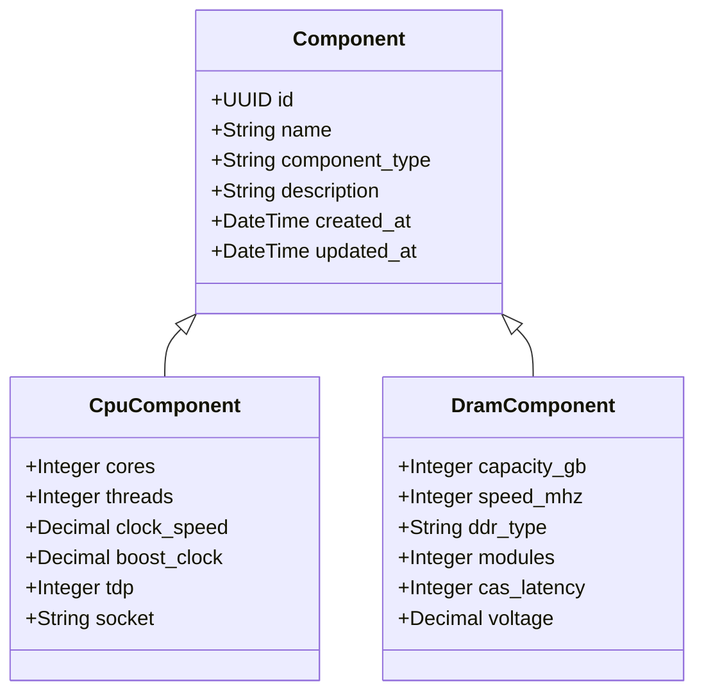

# Architecture

Last Updated: 2026-02-09

## System Overview

Django REST API for managing hardware component performance data. Provides full CRUD operations for specific component types (CPU, DRAM) alongside a read-only aggregate endpoint that surfaces all components regardless of type. The data model uses Django multi-table inheritance, making it straightforward to add new component types without modifying existing code.

## Technology Stack

| Component | Technology | Purpose |
|-----------|-----------|---------|
| Language | Python 3.12 | Runtime |
| Framework | Django 5.1 | Web framework |
| API | Django REST Framework 3.15 | REST API toolkit |
| Database (prod) | PostgreSQL 16 | Primary datastore (Docker) |
| Database (dev) | SQLite 3 | Local development datastore |
| Config | django-environ | Environment-based settings |
| Filtering | django-filter | Queryset filtering for API |
| DB Driver | psycopg2-binary | PostgreSQL adapter |
| Debugging | debugpy | Remote debugger for Docker |

## Data Model

The model hierarchy uses **Django multi-table inheritance**. Each subclass (`CpuComponent`, `DramComponent`) gets its own database table linked to the `Component` table via an auto-created `OneToOneField`. The `component_type` field is auto-set on `save()` in each subclass (e.g., `CpuComponent` sets `component_type = "cpu"`), so callers never need to specify it manually.

`Component` has database indexes on `component_type` and `created_at`. Default ordering is `-created_at`.

## API Design

The API follows a two-tier pattern:

**Read-only aggregate endpoint** -- `/api/components/`
- Uses `GenericViewSet` + `ListModelMixin` + `RetrieveModelMixin` (list and detail only, no create/update/delete).
- Filters: `component_type`. Search: `name`. Ordering: `created_at`, `name`.
- Returns all component types in a single feed.

**Full CRUD per type** -- `/api/cpu/`, `/api/dram/`
- Uses `ModelViewSet` (list, create, retrieve, update, partial_update, destroy).
- `/api/cpu/` -- Search: `name`. Ordering: `created_at`, `name`, `cores`, `clock_speed`.
- `/api/dram/` -- Search: `name`. Ordering: `created_at`, `name`, `capacity_gb`, `speed_mhz`.

Components created via type-specific endpoints automatically appear in the `/api/components/` aggregate endpoint because of the shared `Component` base table.

**Common configuration across all endpoints:**
- URL registration via `DefaultRouter` in each app's `urls.py`
- `PageNumberPagination` with `PAGE_SIZE=20`
- `DjangoFilterBackend`, `SearchFilter`, `OrderingFilter`
- `AllowAny` permissions (public API)

## Adding a New Component Type

To add a new component type (e.g., GPU):

1. Create a new Django app: `python manage.py startapp gpu`
2. Define the model in `gpu/models.py`, extending `Component` with type-specific fields.
3. Override `save()` to auto-set `component_type = "gpu"`.
4. Create a serializer in `gpu/serializers.py` using `ModelSerializer`.
5. Create a viewset in `gpu/views.py` using `ModelViewSet`.
6. Create `gpu/urls.py` with a `DefaultRouter` registration.
7. Add `"gpu"` to `INSTALLED_APPS` in `config/settings.py`.
8. Add `path("api/gpu/", include("gpu.urls"))` to `config/urls.py`.
9. Run `python manage.py makemigrations gpu && python manage.py migrate`.

No changes to the `components` app are needed -- the new type will appear in `/api/components/` automatically.

## Environment Configuration

Settings are loaded via **django-environ** with `overrides=False`, meaning existing environment variables take priority over `.env` file values.

| Variable | Default | Description |
|----------|---------|-------------|
| `SECRET_KEY` | Dev default provided | Django secret key |
| `DEBUG` | `True` | Debug mode |
| `ALLOWED_HOSTS` | `localhost,127.0.0.1` | Allowed host headers |
| `DATABASE_URL` | `sqlite:///db.sqlite3` | Database connection URL |

**Local development**: When `DATABASE_URL` is unset, Django uses SQLite at `db.sqlite3` in the project root.

**Docker**: `docker-compose.yml` sets `DATABASE_URL=postgres://cperf:cperf@db:5432/cperf`. The `entrypoint.sh` script waits for PostgreSQL to become available (30 retries, 2s interval), runs migrations, then executes the container command.

**File conventions**:
- `.env.example` -- Template listing all variables. Committed to the repo.
- `.env.local` -- Local overrides. Gitignored.
